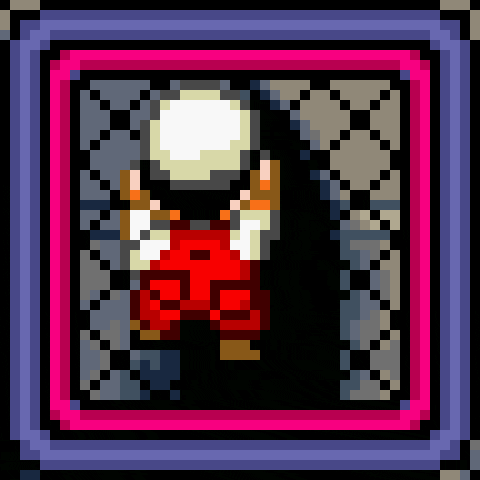

# Bem-vindo ao Super Mario Dev
#### Esse é um game web, desenvolvido com html, css e javaScript. O projeto tem objetivo de exercitar essas tecnologias no contexto de gameficação de processos e avaliações. O objetivo no game é a evolução nas fases com a resolução progressiva problemas, utilizando algorítimos e lógica para interagir com o cenário. let's code!!!

## Tecnologias utilizadas

1. HTML
2. CSS
3. JavaScript

<!--  -->

